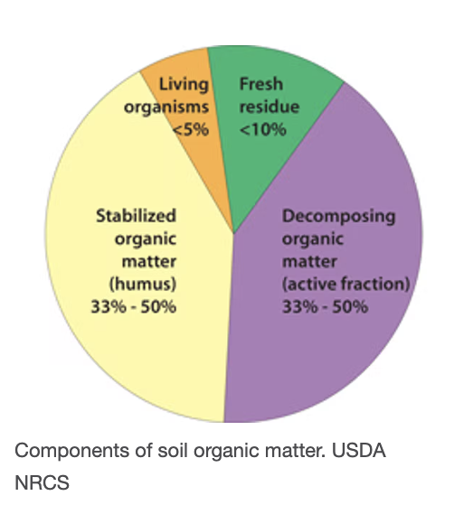
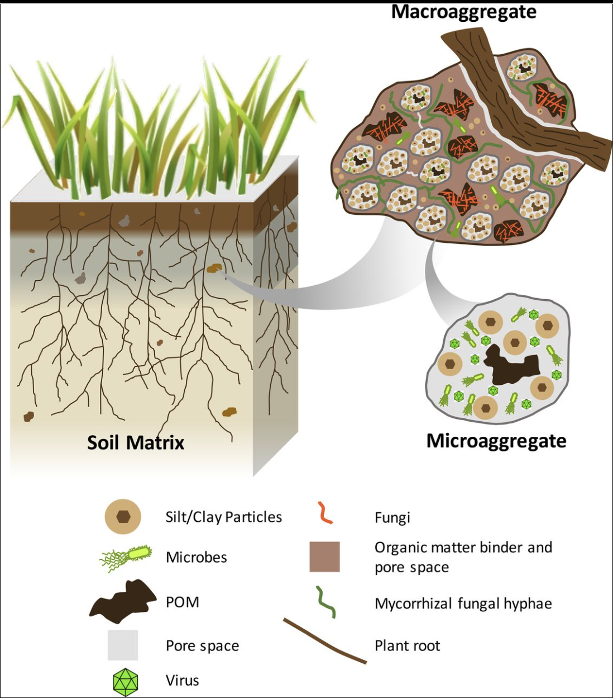

<!-----------------------------------------------  -->
<!-- Table of content                              -->
<!-----------------------------------------------  -->
<!-- START doctoc generated TOC please keep comment here to allow auto update -->
<!-- DON'T EDIT THIS SECTION, INSTEAD RE-RUN doctoc TO UPDATE -->

- [A Global Good Project](#a-global-good-project)
  - [The Open Soil Spectral Library (OSSL)](#the-open-soil-spectral-library-ossl)
  - [OSSL Explorer](#ossl-explorer)
  - [OSSL manual](#ossl-manual)
- [Soil Data Research](#soil-data-research)
  - [Spectroscopy](#spectroscopy)
  - [Soil](#soil)
    - [Soil Minerals](#soil-minerals)
    - [SOM](#som)
    - [Soil Structure](#soil-structure)
    - [SOC](#soc)
    - [Common studied components of soil](#common-studied-components-of-soil)
- [Importance of Soil](#importance-of-soil)
- [Links:](#links)

<!-- END doctoc generated TOC please keep comment here to allow auto update -->

<!-----------------------------------------------  -->
<!-- Title:                                        -->
<!-----------------------------------------------  -->

# A Global Good Project

Image Source: [Soil_Prisma](https://www.fao.org/fileadmin/user_upload/GSP/imgs/GSP_GLOSOLAN_Spect_HomeSlider_920x426.jpg)

The purpose of these series of articles is to explore a path from data collection and analisys to data visualization and machine learning.

My background is in operations, analisys and mathemtics. Special interest to me is the environment and the field of soil science concering the **health** of the soil eco-system.

Coincidentaly, [Hackers News](https://news.ycombinator.com/item?id=32293359) lead me to this acrticle about this open soil sofware development.

## The Open Soil Spectral Library (OSSL)

The Open Soil Spectral Library (OSSL) is a global good project which serves collection of soil properties derived from spectral data. OSSL is also a network that delivers robust statistical models, calibration and predictions models, research tools, and oportiunities to collaborate across borders.

The initiative received a funding award through the National Institute of Food and Agriculture (USDA).
[NIFA](https://www.nifa.usda.gov/about-nifa/press-releases/nifa-invests-over-7-million-big-data-artificial-intelligence-other) has invested over $7 Million in Big Data, Artificial Intelligence, and Other Cyberinformatics Research.

Amoung other valuable resources, the OSSL project offers a beautifully developed software:

## [OSSL Explorer](https://explorer.soilspectroscopy.org/)

and a user manual open for contribution:

## [OSSL manual](https://soilspectroscopy.github.io/ossl-manual/)

<!-----------------------------------------------  -->
<!-- Title:                                        -->
<!-----------------------------------------------  -->

# Soil Data Research

## Spectroscopy

Spectroscopic studies are designed so that the radiant energy interacts with specific types of matter.

Soil spectroscopy is the measurement of light absorption when light in the visible, near infrared or mid infrared (Vis–NIR–MIR) regions of the electromagnetic spectrum is applied to a soil surface. The proportion of the incident radiation reflected by soil is sensed through Vis–NIR–MIR reflectance spectroscopy. These characteristic spectra (see Fig. below) can then be used to estimate numerous soil attributes including: minerals, organic compounds and water.

radiant energy is the energy of electromagnetic and gravitational radiation.[1] As energy, its SI unit is the joule (J). The quantity of radiant energy may be calculated by integrating radiant flux (or power) with respect to time.

The central theory of spectroscopy is that light is made of different wavelengths and that each wavelength corresponds to a different frequency. The importance of spectroscopy is centered around the fact that every different element in the periodic table has a unique light spectrum described by the frequencies of light it emits or absorbs consistently appearing in the same part of the electromagnetic spectrum when that light is diffracted.

spectroscopy, study of the absorption and emission of light and other radiation by matter, as related to the dependence of these processes on the wavelength of the radiation. More recently, the definition has been expanded to include the study of the interactions between particles such as electrons, protons, and ions, as well as their interaction with other particles as a function of their collision energy.

https://www.britannica.com/science/spectroscopy

Visible and near infraread light [VIS-NIR](https://www.sciencedirect.com/topics/agricultural-and-biological-sciences/reflectance-spectroscopy#:~:text=NEAR%2DINFRARED%20REFLECTANCE%20SPECTROSCOPY%20ANALYSIS,%2C%20energy%2C%20and%20mineral%20content.)

The reflected infrared radiation is converted to electrical energy and fed to a computer for interpretation. Each major organic component of the soil absorbs and reflects visible, near-infrared light, and mid-infrared light differently. By measuring these different reflectance characteristics, the Spectroradiometer and a computer determine the quantity of these components in the soil sample.

Absorbance is high therefore reflectance is low.

Spectral signature picked up from the Spectroradiometer(SRM).

## Soil

Soil is a living system working as a life-sustaining resource. It teams up with billions of bacteria, fungi, and other microbes to create an abundant [soil community](https://www.sciencedirect.com/topics/earth-and-planetary-sciences/microbial-community) filled with diverse soil biota. In a way, soil is a living body of minerals, organisms, soil organic matter, gas and water.

[Reference](https://www.nature.com/scitable/knowledge/library/what-are-soils-67647639/#:~:text=Soil%20is%20a%20material%20composed,mineralogy%20of%20soils%20is%20diverse.)

Organism abundance, diversity, and exude activity are not randomly distributed in soil, but vary in a patchy fashion both horizontally across a landscape and vertically through the [soil profile](https://www.sciencedirect.com/topics/earth-and-planetary-sciences/soil-biota). Thus each soil profile can communicate a story of time and soil formation. The image below show some examples of soil horizons.

[Image Source](https://www.youtube.com/watch?v=_aZbGBaP_7Y)
[soil profile](https://www.youtube.com/watch?v=_aZbGBaP_7Y)

### Soil Minerals

Soil minerals give soil the different texture attritubtes and colors. They are classified by size:

[Image Source](https://www.ctahr.hawaii.edu/mauisoil/a_comp01.aspx)

[Image Source](https://www.nature.com/scitable/knowledge/library/what-are-soils-67647639/)

The most common mineral in soils is quartz; it is not very reactive. On the other hand, clay is very reactive. In fact, an importa role of soil is the synthesis of clay minerals.

clay is reactive to ions, water
clay particles that result in strong protected structures that store soil C for long periods of time (https://www.sciencedirect.com/topics/earth-and-planetary-sciences/soil-aggregate)

(https://www.nature.com/scitable/knowledge/library/what-are-soils-67647639/#:~:text=Soil%20is%20a%20material%20composed,mineralogy%20of%20soils%20is%20diverse.)

### SOM

Soil organic matter [SOM](https://www.nature.com/scitable/knowledge/library/what-are-soils-67647639/#:~:text=Soil%20is%20a%20material%20composed,mineralogy%20of%20soils%20is%20diverse.) is plant, animal, and microbial residues in various states of transformation or decomposition. Higher SOM is among the best indicators of agricultural soil quality. Below is an image showing the composition of SOM.

[Image Source:](https://theconversation.com/to-restore-our-soils-feed-the-microbes-79616)

> For example, bellow are Swedish soils samples demonstrating the interaction of sand-and-clay textures versus SOM compositions

> 
> Image Source: [FAO](https://youtu.be/QVOx4oFugts)(min: 37:42)

> The left-samples are 100% sand, no clay while the right-samples illite clay soil samples; thus, they appear brighter in color.

> The bottom-samples have no organic matter while the top-samples have very little organic matter; thus, they appear darker.

### Soil Structure

[Soil structure](https://www.sciencedirect.com/topics/earth-and-planetary-sciences/soil-structure) refers to the proportions of solids and voids in a soil. A key aspect of soil structure is the aggregation of individual mineral and organic particles into larger units.

### SOC

---

Soil [aggregates](https://www.nrcs.usda.gov/Internet/FSE_DOCUMENTS/nrcs142p2_052820.pdf)are groups of soil particles binding to each others more strongly than to other adjecent particles leaving voids for both water and air.

Soil structure is influenced by texture, clay mineralogy, climatic wet–dry and freeze–thaw cycles, characteristics of the plants and organic matter, and activities of soil biota. The [soil biota](https://www.sciencedirect.com/topics/earth-and-planetary-sciences/soil-biota) provide key macroaggregates promotes soil structure by contributing organic matter in the form of plant litter , faunal fecal material (Frouz, 2018), and microbial residues (Abiven et al., 2009; Kallenbach et al., 2016). Roots and fungi also physically bind soil particles together (i.e., enmeshment) and release substances such as the glycoprotein glomalin that act as binding agents, which promote soil aggregate stability

Larger aggregates are called macroaggregaesa compried of visible SOM decomposable by light while smaller aggregates are called microaggregaes.

---

there are several

Biological processes that result in the formation of “biological macroaggregates”:\
(1) Fresh plant- and root-derived residues form the nucleation sites for the growth of fungi and bacteria. Macroaggregate formation is initiated by fungal hyphae enmeshing fine particles into macroaggregates. Exudates from both bacteria and fungi, produced as a consequence of decomposition of fresh residues, form binding agents that further stabilize macroaggregates.

(2) Biological macroaggregates also form around growing roots in soils, with roots and their exudates enmeshing soil particles, thereby stimulating microbial activity

(3) A third principal mechanism of biological macroaggregate formation in soils in all climates is via the action of soil fauna, particularly earthworms, termites, and ants. For example, earthworms often produce casts that are rich in organic matter and are not stable when freshly formed and wet. During gut passage, the soil and organic materials are kneaded thoroughly and copious amounts of watery mucus are added as well. This molding process breaks bonds between soil particles, but can lead to casts that are quite stable upon drying. It is also worth noting that soil mesofauna, for example collembola and mites, are important in the SOM formation process through their production of copious amounts of fecal pellets. Effects of meso- and macrofauna on soil structure are discussed further in Chapter 4 on soil fauna.

Soil [aggregated](https://www.nrcs.usda.gov/Internet/FSE_DOCUMENTS/nrcs142p2_052820.pdf) structure: soil particles binding to each others more strongly than to other adjecent particles leaving voids for both water and air.

Organism abundance, diversity, and activity are not randomly distributed in soil, but vary in a patchy fashion both horizontally across a landscape and vertically through the soil profile. Different groups

Soil is living body of minerals, living organism, soil organic matter (SOM), gas and water.
[Reference](https://www.nature.com/scitable/knowledge/library/what-are-soils-67647639/#:~:text=Soil%20is%20a%20material%20composed,mineralogy%20of%20soils%20is%20diverse.)

Soil aggregates

also a stable [aggregated](https://www.nrcs.usda.gov/Internet/FSE_DOCUMENTS/nrcs142p2_052820.pdf) structure: soil particles binding to each others more strongly than to other adjecent particles leaving voids for both water and air.

Soil structure refers to the proportions of solids and voids in a soil, the voids providing the space for both water and air. A key aspect of soil structure is the aggregation of individual mineral and organic particles into larger units (Binkley and Fisher, 2013). Soil structure is influenced by characteristics of the soil (especially texture and clay mineralogy), climatic factors (especially wet–dry and freeze–thaw cycles), characteristics of the plants and organic matter, and activities of soil biota (Daynes et al., 2013; Rashid et al., 2016; Bronick and Lal, 2005; Regelink et al., 2015). The soil biota promotes soil structure by contributing organic matter in the form of plant litter (especially root litter; Rasse et al., 2005), faunal fecal material (Frouz, 2018), and microbial residues (Abiven et al., 2009; Kallenbach et al., 2016). Roots and fungi also physically bind soil particles together (i.e., enmeshment) and release substances such as the glycoprotein glomalin that act as binding agents, which promote soil aggregate stability

soil is made up of different-sized mineral particles (sand, silt, and clay) including organic matter.

and has complex biological, chemical, physical, mineralogical, and hydrological properties that are always changing over time. Soil is ubiquitous and is dynamic, teeming with organisms, and is an integral part of both terrestrial and aquatic environments. But for farmers, gardeners, and agronomists, soil is just a medium for growing crops, pastures, and plants. And for engineers, soil is a material to build on and excavate. Thus soils can be both naturally occurring, comprising natural minerals and organic materials, and human-made, such as those that often contain very small amounts of manufactured materials, including brick fragments, explosive residues, or paint flecks. It is this soil diversity and heterogeneity that has enabled forensic soil examiners to distinguish between soils that may appear to be similar to the untrained observer.

### Common studied components of soil

- minerals
- gas
- H2O
- Carbon
- Nitrogen
- Clay Formation
- soil organic matter (SOM)
- living organisms
- soild organic Carbon (SOC)
- soil fauna
- macroaggregate and microaggregate:
- microaggregate

Soil color is produced by the minerals present and by the organic matter content. Yellow or red soil indicates the presence of oxidized ferric iron oxides. Dark brown or black color in soil indicates that the soil has a high organic matter content. Wet soil will appear darker than dry soil.

Th (Figure 1); the percentages of particles in these size classes is called soil texture. The mineralogy of soils is diverse.

For example, a clay mineral called smectite can shrink and swell so much upon wetting and drying

(Figure 2) that it can knock over buildings. The most common mineral in soils is quartz; it makes beautiful crystals but it is not very reactive.

<!-----------------------------------------------  -->
<!-- Title:                                        -->
<!-----------------------------------------------  -->

# Importance of Soil

[soil biota](https://www.sciencedirect.com/topics/earth-and-planetary-sciences/soil-biota)

[soil carbon](https://www.sciencedirect.com/topics/earth-and-planetary-sciences/soil-carbon)

[soil community](https://www.sciencedirect.com/topics/earth-and-planetary-sciences/microbial-community)

As some might simply explain:
Dirt feeds plants, plants feed animals and some animals eat other animals.

However, the importance of undertaidng the omposition og the soil at eac soil site is key for the environmental protection of the earth.

Soil organic C binds mineral particles to form aggregates (Oades, 1993), whose distribution and stability influence the soil’s physical properties, including pore size distribution, bulk density, soil strength, and soil erodibility (Tatarko, 2001; Chapter 3: Microbial Modulators and Mechanisms of Soil Carbon Storage).

Loss of organic matter affects soil structure and aggregate formation, with negative impacts on biological diversity, soil fertility, crop production potential, erosion control, water retention, matter exchange between soil, atmosphere, groundwater, and the filtering, buffering, and transforming capacity of terrestrial ecosystems (Huber et al., 2001; Kirchmann and Andersson, 2001).

Soil management practices that improve formation of soil aggregates through an increase in SOC have demonstrated minimizing soil and nutrient losses through erosion mitigation and eutrophication of surface waters (Srinivasarao et al., 2015). The success of these soil management systems, however, relies strongly on site-specific characteristics, farmers’ awareness and knowledge, and often on weather events.

Aquatic microbial community can be defined as an assemblage of co-occurring, and potentially interacting, microbes, present in a defined habitat in space and time. Despite the small size, microorganisms are key elements for the ecological dynamics of the biosphere. They are not only the most diffused life forms; they are also characterized by an incredible functional and genetic diversity, contributing fundamentally to the biogeochemical processes on Earth.

Carbon Sequestration (CSeq) is a process that converts organic matter into carbon.

<!-----------------------------------------------  -->
<!-- Title:                                        -->
<!-----------------------------------------------  -->

# Links:

- [A Global Good Project](#a-global-good-project)
  - [The Open Soil Spectral Library (OSSL)](#the-open-soil-spectral-library-ossl)
  - [OSSL Explorer](#ossl-explorer)
  - [OSSL manual](#ossl-manual)
  - [video webimar](https://youtu.be/QVOx4oFugts)
