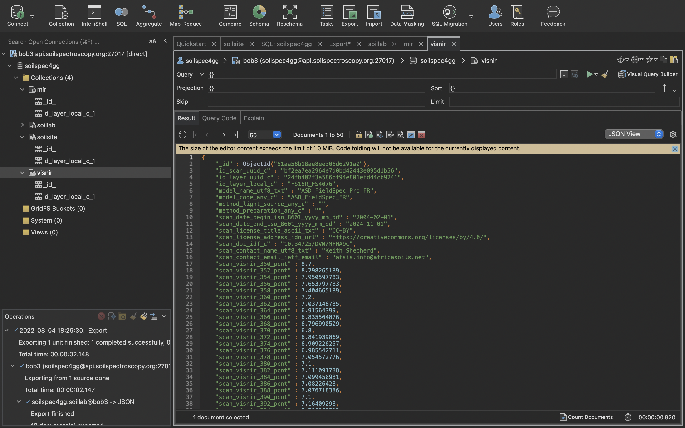

# Soil Data Research

# Hackers News Article On Soil Data
1. [Hackers News](https://news.ycombinator.com/item?id=32293359)
1. [Open Soil Spectral Library
](https://soilspectroscopy.github.io/ossl-manual/)
1. [NIFA Invests Over $7 Million in Big Data, Artificial Intelligence, and Other Cyberinformatics Research](https://www.nifa.usda.gov/about-nifa/press-releases/nifa-invests-over-7-million-big-data-artificial-intelligence-other)
1. [mongodb connection docs](https://soilspectroscopy.github.io/ossl-manual/index.html#ossl-mongodb)
1. [OSSL Web API](https://api.soilspectroscopy.org/__docs__/#/)

# Tools and Libraries

## install RStudio
1. [RStudio](https://www.rstudio.com/products/rstudio/download/#download)
## install monogolite
[mongolite](https://jeroen.github.io/mongolite/index.html#install-mongolite-in-r)

## cert error

## using mongodb in r
[How to Use R with MongoDB](https://www.mongodb.com/languages/mongodb-and-r-example)
```R
connection_string = 'mongodb+srv://<username>:<password>@<cluster-name>.mongodb.net/sample_training'
trips_collection = mongo(collection="trips", db="sample_training", url=connection_string)
```
## fixing the cert error with options
```R
trips_collection = mongo(collection="soillab", url=connection_string, options = ssl_options(weak_cert_validation = T))
```
## queries are not working
```R
> trips_collection$count('{}')
Error: not authorized on test to execute command { aggregate: "soillab", cursor: {}, pipeline: [ { $match: {} }, { $group: { _id: 1, n: { $sum: 1 } } } ], $db: "test", lsid: { id: UUID("b1e14775-e7f2-4a2e-9ee5-e58507553e73") } }
> trips_collection$info()
Error: not authorized on test to execute command { serverStatus: 1, $db: "test", lsid: { id: UUID("b1e14775-e7f2-4a2e-9ee5-e58507553e73") } }
> trips_collection$info({})
Error in trips_collection$info({ : unused argument ({
})
> trips_collection$find({limit=10})
Error: argument must be bson or json.
> trips_collection$find(limit=10)
Error: not authorized on test to execute command { find: "soillab", filter: {}, projection: { _id: 0 }, sort: {}, skip: 0, limit: 10, noCursorTimeout: false, $db: "test", lsid: { id: UUID("b1e14775-e7f2-4a2e-9ee5-e58507553e73") } }
> 
```
## Studio 3T for Connecting to MongoDB
[Studio 3T](https://studio3t.com)


Install mongoDB:

```
npm install mongodb
```

Verify version:

```
npm list mongodb
```

Step 1: Connect to MongoDB

```
var MongoClient = require('mongodb').MongoClient;
var assert = require('assert');
```

Step 2: Retrive a list of databases

Step 3:Printing the results to your console

# Other Resources
- SheetsJS
- article
- MongoDB
- Connect MongoDB with JS
