<!-- START doctoc generated TOC please keep comment here to allow auto update -->
<!-- DON'T EDIT THIS SECTION, INSTEAD RE-RUN doctoc TO UPDATE -->

- [A Global Good Project](#a-global-good-project)
  - [The Open Soil Spectral Library (OSSL)](#the-open-soil-spectral-library-ossl)
  - [OSSL Explorer](#ossl-explorer)
  - [OSSL manual](#ossl-manual)
- [Soil Data Research](#soil-data-research)
- [Importance](#importance)
- [Connecting to the OSSL](#connecting-to-the-ossl)
- [Exporting the OSSL as `.CSV`](#exporting-the-ossl-as-csv)
- [Exporting a Sample of the OSSL as `.CSV`](#exporting-a-sample-of-the-ossl-as-csv)
- [WIP --> Building a Data Pipeline](#wip----building-a-data-pipeline)

<!-- END doctoc generated TOC please keep comment here to allow auto update -->

# A Global Good Project

> Posted on [Hackers News](https://news.ycombinator.com/item?id=32293359)


## The Open Soil Spectral Library (OSSL)

The Open Soil Spectral Library (OSSL) is a global good project which serves collection of soil properties derived from spectral data. OSSL is also a network that delivers robust statistical models specifically calibration and predictions models, research tools, and oportiunities to collaborate across borders.

The initiative is funded through the National Institute of Food and Agriculture (USDA).
[NIFA](https://www.nifa.usda.gov/about-nifa/press-releases/nifa-invests-over-7-million-big-data-artificial-intelligence-other) has invested over $7 Million in Big Data, Artificial Intelligence, and Other Cyberinformatics Research.

The OSSL project offers a beautifully developed software:

## [OSSL Explorer](https://explorer.soilspectroscopy.org/)

and a user manual open for contribution:

## [OSSL manual](https://soilspectroscopy.github.io/ossl-manual/)


# Soil Data Research

Visible and near infraread light [VIS-NIR](https://www.sciencedirect.com/topics/agricultural-and-biological-sciences/reflectance-spectroscopy#:~:text=NEAR%2DINFRARED%20REFLECTANCE%20SPECTROSCOPY%20ANALYSIS,%2C%20energy%2C%20and%20mineral%20content.)


The reflected infrared radiation is converted to electrical energy and fed to a computer for interpretation. Each major organic component of the soil absorbs and reflects visible, near-infrared light, and mid-infrared light differently. By measuring these different reflectance characteristics, the Spectroradiometer and a computer determine the quantity of these components in the soil sample.


Spectral signature picked up from the Spectroradiometer(SRM).


# Importance

1. Monitoring and predicting soil properties
1. Health System Thinking:
   > `Microbiome ⭌ Soil ⭌ Plants ⭌ Plant-based diet ⭌ Human Microbiomes ⭌ Longevity ⭌ Synchronize with natural`
1. Data Science
1. The miccrobiome of the soil, food, agriculture and human microbiomes are linked.
1. soil organic matter (SOM), soil organic carbon (SOC)
1. Soil microbiome

# Connecting to the OSSL

The OSSL manual mentioned two ways to access the data. The first method is using MongoDb via R; however, the last yields a certification error. See image below:


Also, when using NodeJS to connect to mongodb yields a certificate error

```
/Users/dev/code/soil_data_research/node_modules/mongodb/lib/utils.js:419
                    throw error;
                    ^

MongoServerSelectionError: certificate has expired
    at Timeout._onTimeout (/Users/dev/code/soil_data_research/node_modules/mongodb/lib/sdam/topology.js:293:38)
    at listOnTimeout (node:internal/timers:564:17)
    at process.processTimers (node:internal/timers:507:7) {
  reason: TopologyDescription {
    type: 'Unknown',
```

Thus, we used the second method from the OSSL manual to access the data. Here, we used Studio 3T and inserted the following parameters:

- Connection Name: `soilspec4gg`
- Server: `api.soilspectroscopy.org`
- Authentication DB: `soilspec4gg`
- User name: `soilspec4gg`
- Password: `soilspec4gg`
- Use SSL: `true`
- Accept any SSL certificates: `true`

Step 1: Free download [Studio 3T](https://robomongo.org/) and complete installation.

Step 2: In Studio 3T,

- click on the New Collection icon:
  <!------------------------------------------------->
  <!-- image                                       -->
  <!------------------------------------------------->

  

- select the `manually configure my connection setting` option
  
- Fill in the Connection name: `soilspec4gg` and, in the `Server` tab, fill with OSSL's given address: `api.soilspectroscopy.org`
  

- Go to the Authentication tab and select Basic Authentication Mode:
  

  - Fill in the User name, Password and Authentication DB with `soilspec4gg`
    

- Under the SSL tab, select `Use SSL protocol to connect` and `accept any server SSL certificates`
  

- Test Connection before saving:
  

- Finally, click save and connect.
  

# Exporting the OSSL as CSV

- Find the `soilsite` collection in `soispec4gg`
  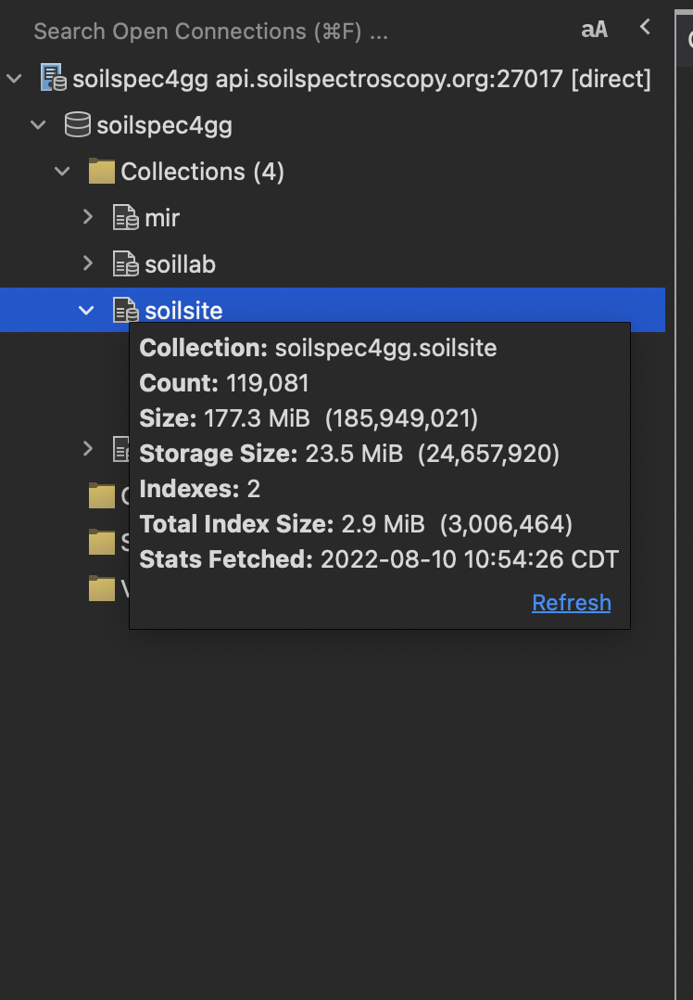
  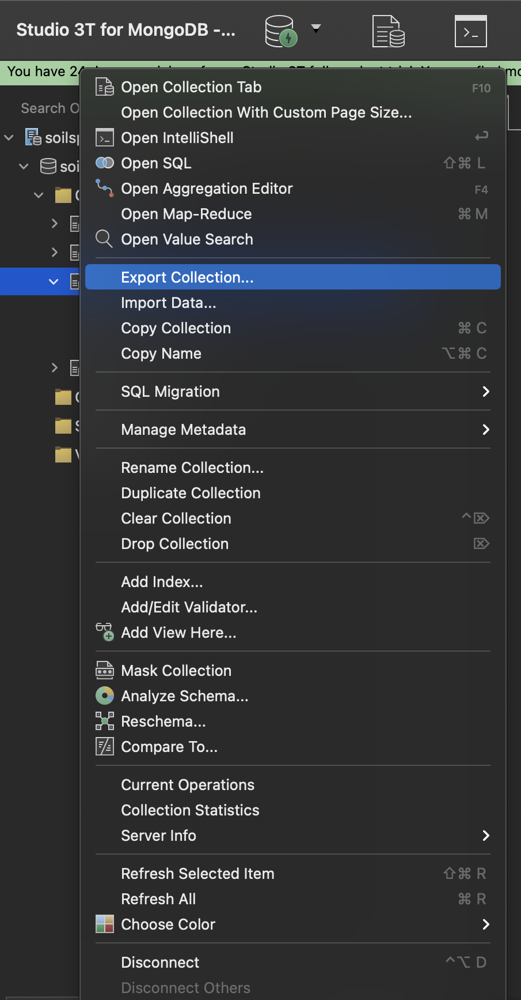

- Select `CSV` and click `Configure`
  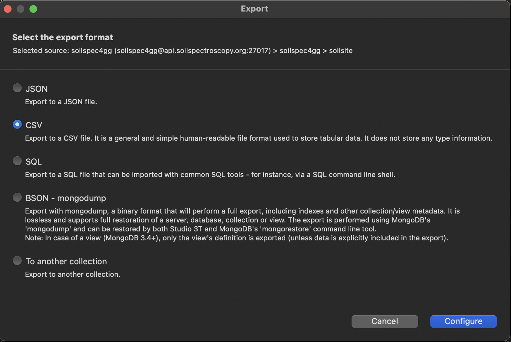

- Set the `Export Target` to be the current working directory. For instance, name the file `soilsite.csv` and save it.
  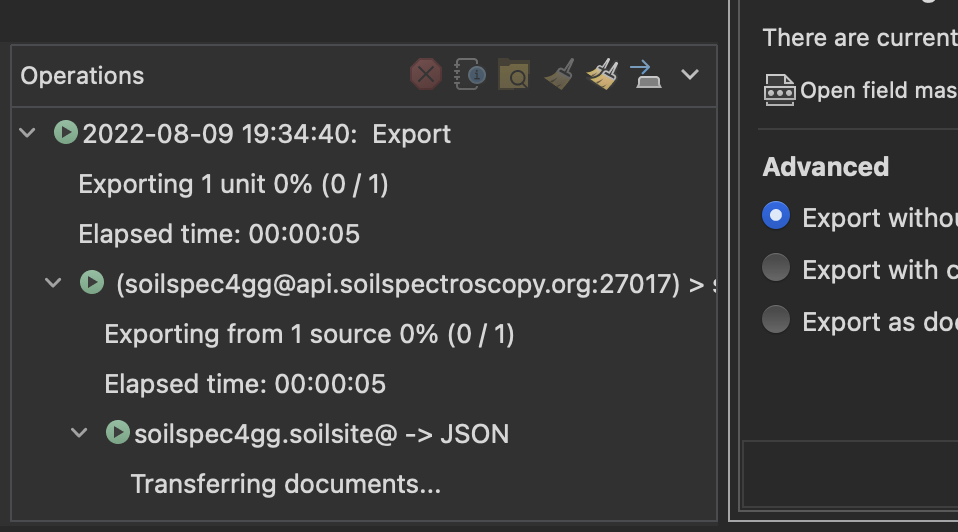
  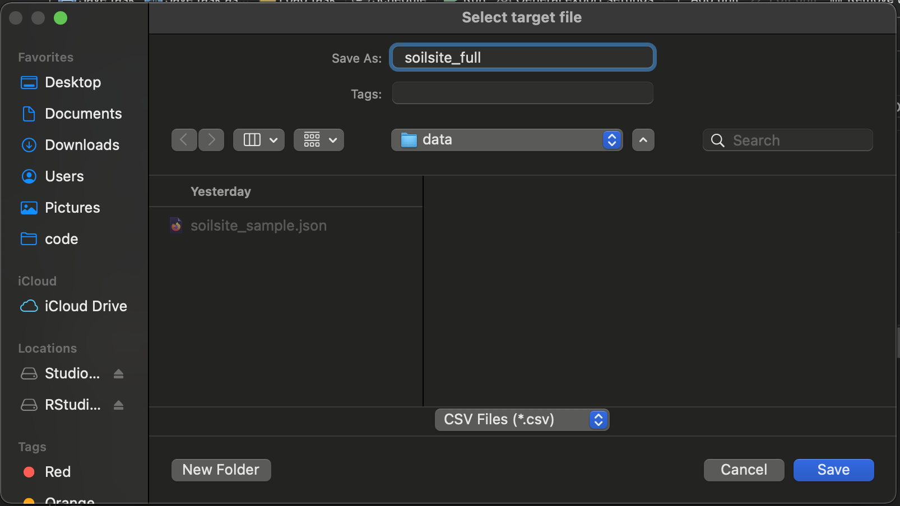

- Click `Run`
  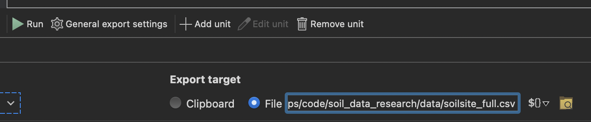

- Results from the export are shown in the console.
  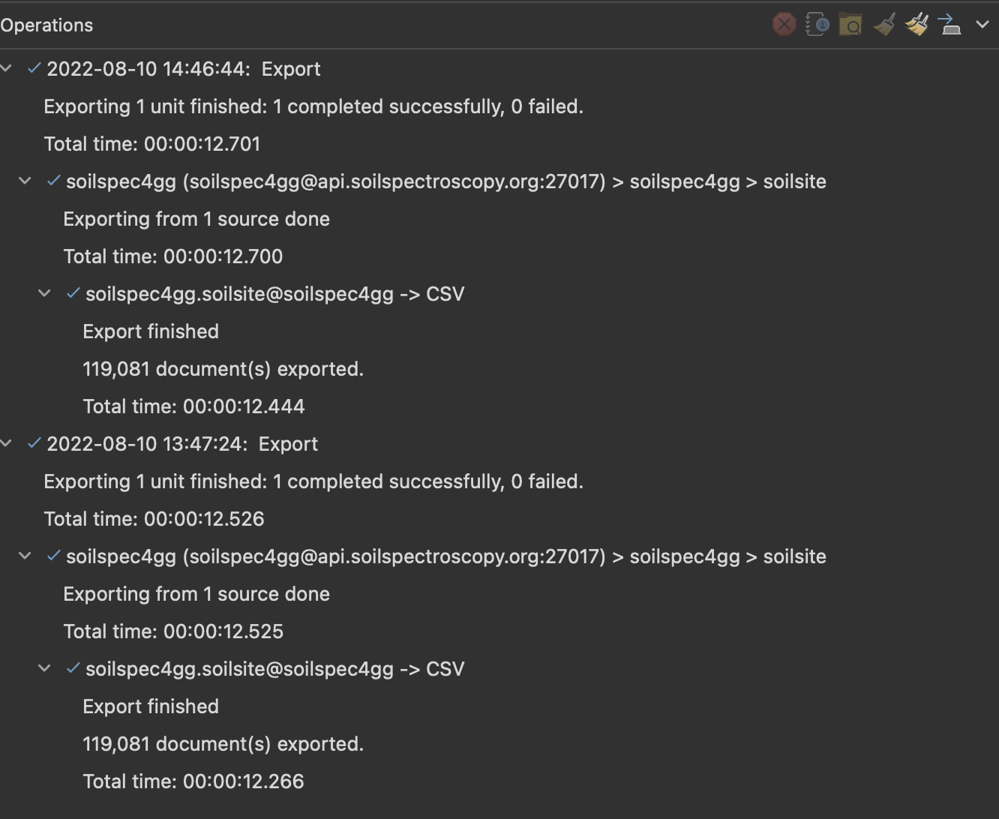

- The data `soilsite_full.csv` is now exported to the current working directory.
  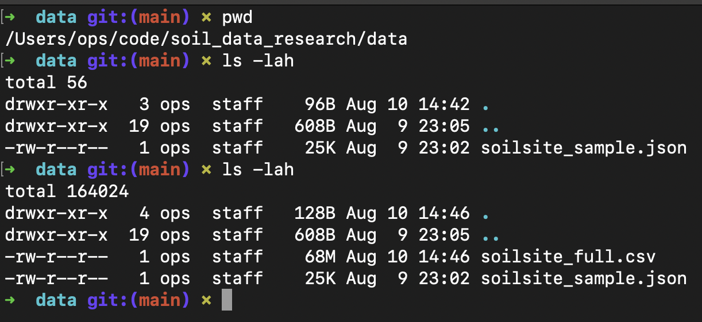

# Exporting a Sample of the OSSL as `.CSV`

To export a sample of the data, querry 10 samples from the `soilsite` collection:

- Double click the `soilsite` collection.
  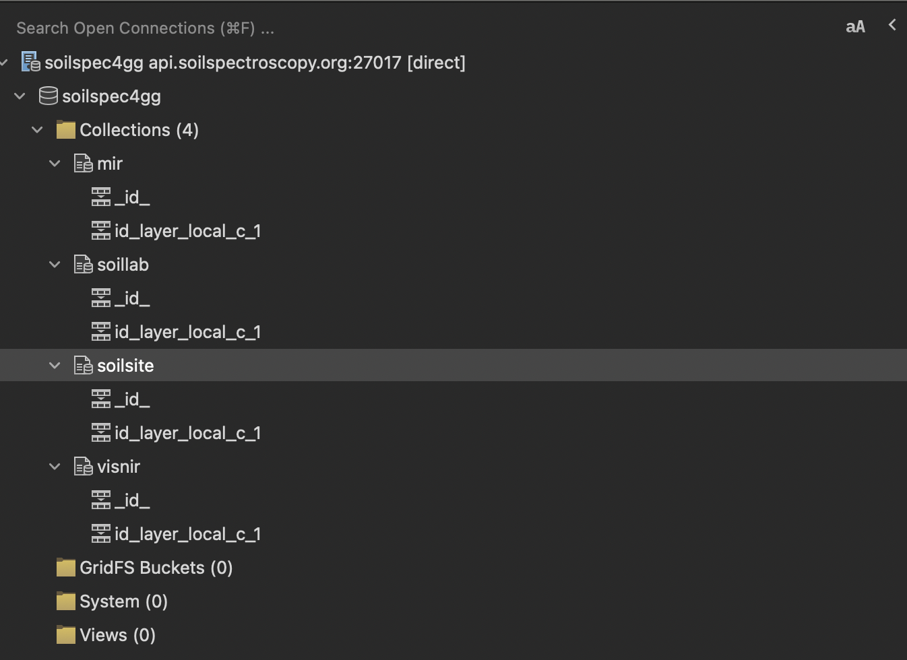

- Run the entire script (`F5`)
  
  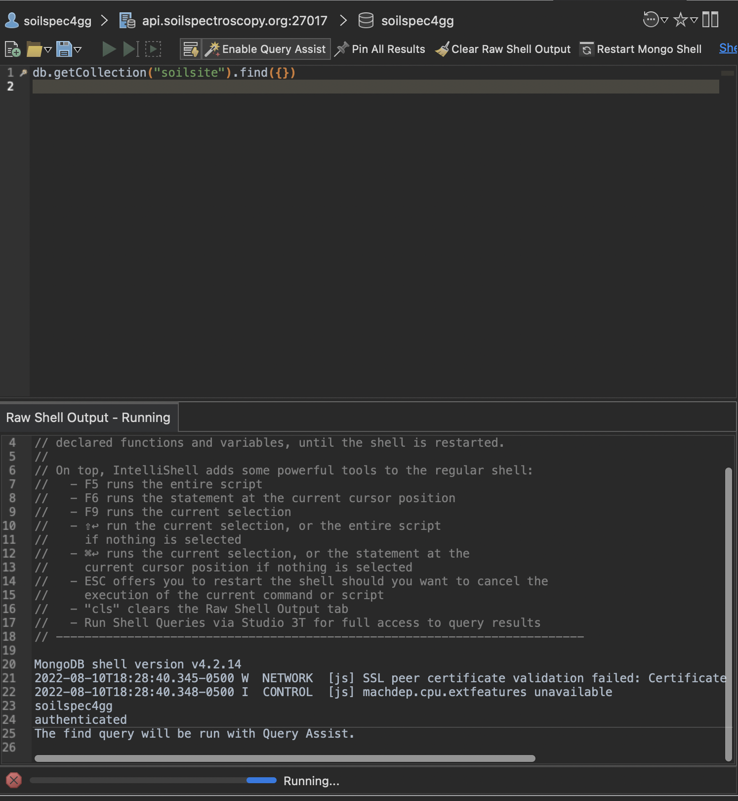

- Select 10 samples
  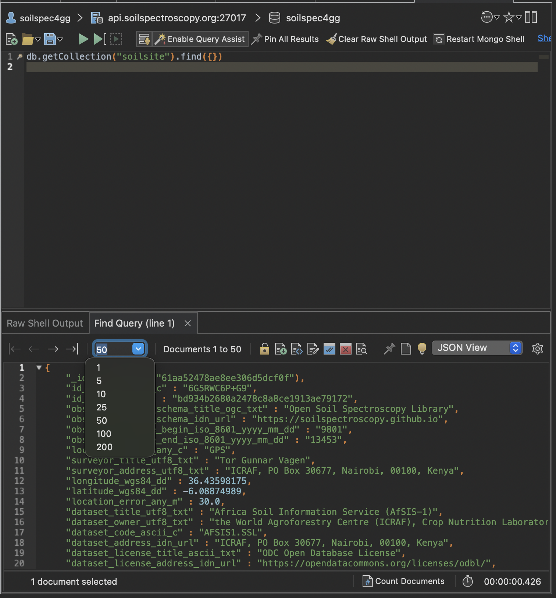

- Right click anywhere inside the 10 sample query and select `Export Documents`
  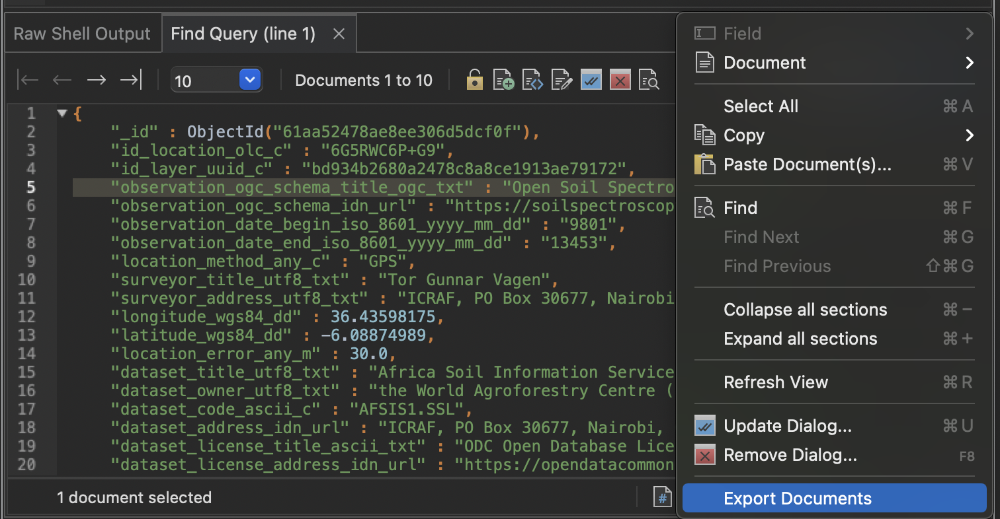

- Select `Current Query Result`. Then follow the same steps to select and configure the CSV file described [earlier](#exporting-the-ossl-as-csv).
  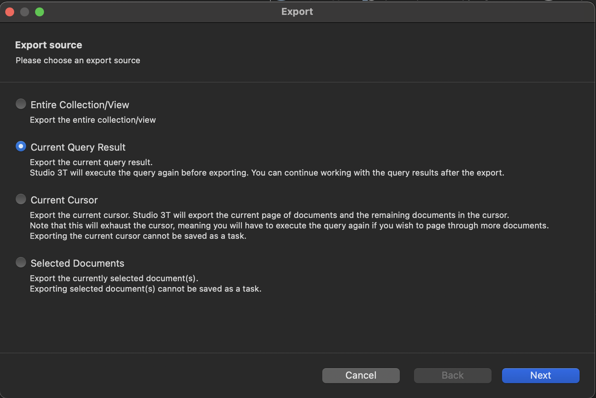

# WIP --> Building a Data Pipeline
