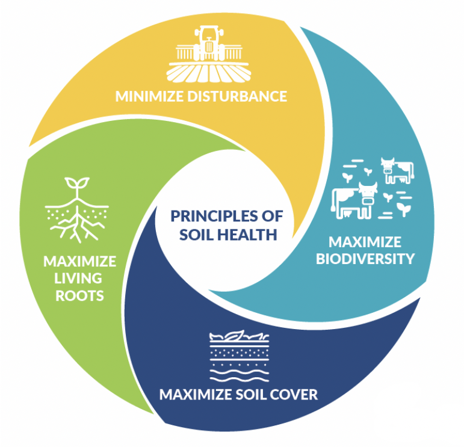

<!-- START doctoc generated TOC please keep comment here to allow auto update -->
<!-- DON'T EDIT THIS SECTION, INSTEAD RE-RUN doctoc TO UPDATE -->

- [A Global Good Project](#a-global-good-project)
  - [The Open Soil Spectral Library (OSSL)](#the-open-soil-spectral-library-ossl)
  - [OSSL Explorer](#ossl-explorer)
  - [OSSL manual](#ossl-manual)
- [Soil Data Research](#soil-data-research)
  - [Spectroscopy](#spectroscopy)
  - [Soil](#soil)
    - [Soil Minerals](#soil-minerals)
    - [SOM](#som)
    - [Soil Structure](#soil-structure)
    - [SOC](#soc)
    - [Principles of Soil Health](#principles-of-soil-health)
- [Connecting to the OSSL](#connecting-to-the-ossl)
- [Exporting the OSSL as CSV](#exporting-the-ossl-as-csv)
- [Exporting a Sample of the OSSL as CSV](#exporting-a-sample-of-the-ossl-as-csv)
- [WIP --> Building a Data Pipeline](#wip----building-a-data-pipeline)

<!-- END doctoc generated TOC please keep comment here to allow auto update -->

<!-----------------------------------------------  -->
<!-- Title:                                        -->
<!-----------------------------------------------  -->

# A Global Good Project


Image Source: [Soil_Prisma](https://www.fao.org/fileadmin/user_upload/GSP/imgs/GSP_GLOSOLAN_Spect_HomeSlider_920x426.jpg)

The purpose of these series of articles is to explore a path from data collection and analisys to data visualization and machine learning.

My background is in operations, analisys and mathemtics. Special interest to me is the environment and the field of soil science concering the **health** of the soil eco-system.

Coincidentaly, [Hackers News](https://news.ycombinator.com/item?id=32293359) lead me to this acrticle about this open soil sofware development.

## The Open Soil Spectral Library (OSSL)

The Open Soil Spectral Library (OSSL) is a global good project which serves collection of soil properties derived from spectral data. OSSL is also a network that delivers robust statistical models, calibration and predictions models, research tools, and oportiunities to collaborate across borders.

The initiative received a funding award through the National Institute of Food and Agriculture (USDA).
[NIFA](https://www.nifa.usda.gov/about-nifa/press-releases/nifa-invests-over-7-million-big-data-artificial-intelligence-other) has invested over $7 Million in Big Data, Artificial Intelligence, and Other Cyberinformatics Research.

Amoung other valuable resources, the OSSL project offers a beautifully developed software:

## [OSSL Explorer](https://explorer.soilspectroscopy.org/)

and a user manual open for contribution:

## [OSSL manual](https://soilspectroscopy.github.io/ossl-manual/)


<!-----------------------------------------------  -->
<!-- Title:                                        -->
<!-----------------------------------------------  -->

# Soil Data Research

## Spectroscopy

The importance of [spectroscopy](https://en.wikipedia.org/wiki/Spectroscopy) is centered around the fact that every different element in the periodic table has a unique light spectrum described by the frequencies of light it emits or absorbs consistently appearing in the same part of the electromagnetic spectrum when that light is diffracted.

[Soil spectroscopy](<(https://soilspectroscopy.org/about/#:~:text=Soil%20spectroscopy%20offers%20a%20safe%20and%20rapid%20alternative%20(Figure%201).&text=Soil%20spectroscopy%20is%20the%20measurement,applied%20to%20a%20soil%20surface.)>) is the measurement of light absorption when light in the visible, near infrared or mid infrared (Vis–NIR–MIR) regions of the electromagnetic spectrum is applied to a soil surface. The proportion of the incident radiation reflected by soil is sensed through Vis–NIR–MIR reflectance spectroscopy. These characteristic spectra can then be used to estimate numerous soil attributes including: minerals, organic compounds and water.


The reflected infrared radiation is converted to electrical energy and fed to a computer for interpretation. Each major organic component of the soil absorbs and reflects visible, near-infrared light, and mid-infrared light differently. By measuring these different reflectance characteristics, the Spectroradiometer and a computer determine the quantity of these components in the soil sample.

Typical soil spectrum in the visible, near-infrared, and mid-infrared portion of the Electrocromagnetic Spectrum (EM Spectrum) is shown in below figure.


[Image Source: Advances in Agronomy](https://www.sciencedirect.com/topics/agricultural-and-biological-sciences/reflectance-spectroscopy#:~:text=NEAR%2DINFRARED%20REFLECTANCE%20SPECTROSCOPY%20ANALYSIS,%2C%20energy%2C%20and%20mineral%20content.)

Light absorbtion in the visible region is due to excitation of electron. With longer wavelengths, NIR and MIR, the absorption is due to [vibrations](https://youtu.be/QVOx4oFugts) in the chemical bonds within molecules: symetrical stretch, asymetrical stretch, and bending vibrations. Thus, the spectra will show primary absorption in the MIR region and overtones and combinations in the NIR region.

## Soil

Soil is a living system working as a life-sustaining resource. It teams up with billions of bacteria, fungi, and other microbes to create an abundant [soil community](https://www.sciencedirect.com/topics/earth-and-planetary-sciences/microbial-community) filled with diverse soil biota.

Soils have [4 basic components](http://www.nzdl.org/cgi-bin/library?e=d-00000-00---off-0hdl--00-0----0-10-0---0---0direct-10---4-------0-1l--11-en-50---20-about---00-0-1-00-0-0-11----0-0-&a=d&c=hdl&cl=CL1.16&d=HASH412cd503b5262205ac14c6.3.1):

- Mineral particles: sand, silt, and clay
- Organic matter
- Water
- Air

Organism abundance, diversity, and activity are not randomly distributed in soil, but vary in a patchy fashion both horizontally across a landscape and vertically through the [soil profile](https://www.sciencedirect.com/topics/earth-and-planetary-sciences/soil-biota).


[Image Source: Soil Horizons](https://www.youtube.com/watch?v=_aZbGBaP_7Y)

Most soils evolve slowly over centuries through the weathering of underlying rock and the decomposition organic matter. Other soils are formed from deposits laid down by rivers and seas or by wind forces.

> A sample of typical [topsoil](http://www.nzdl.org/cgi-bin/library?e=d-00000-00---off-0hdl--00-0----0-10-0---0---0direct-10---4-------0-1l--11-en-50---20-about---00-0-1-00-0-0-11----0-0-&a=d&c=hdl&cl=CL1.16&d=HASH412cd503b5262205ac14c6.3.1) contains about
>
> - ~50% pore space filled with varying proportions of air and water, depending on the soil's current moisture content.
> - ~50% of the volume is made up of mineral particles and organic matter

> Organic soils like peats are formed in marshes, bogs, and swamps contain 30-100 percent organic matter.

### Soil Minerals

Soil minerals give soil the different texture attritubtes and colors. They are classified by size:


[Image Source](https://www.ctahr.hawaii.edu/mauisoil/a_comp01.aspx)


[Image Source](https://www.nature.com/scitable/knowledge/library/what-are-soils-67647639/)

The most common mineral in soils is quartz; it is not very reactive. On the other hand, clay is very reactive. In fact, an importa role of soil is the synthesis of clay minerals.

Clay particles can form strong protected structures that [store soil C](<(https://www.sciencedirect.com/topics/earth-and-planetary-sciences/soil-aggregate)>) for long periods of time.

Clay particles in soil ensure good water-holding capacity and provide [a good of plant nutrients](http://www.nzdl.org/cgi-bin/library?e=d-00000-00---off-0hdl--00-0----0-10-0---0---0direct-10---4-------0-1l--11-en-50---20-about---00-0-1-00-0-0-11----0-0-&a=d&c=hdl&cl=CL1.16&d=HASH412cd503b5262205ac14c6.3.4).

### SOM

Soil organic matter [SOM](https://www.nature.com/scitable/knowledge/library/what-are-soils-67647639/#:~:text=Soil%20is%20a%20material%20composed,mineralogy%20of%20soils%20is%20diverse.) is plant, animal, and microbial residues in various states of transformation or decomposition. Higher SOM is among the best indicators of agricultural soil quality. Below is an image showing the composition of SOM.


[Image Source:](https://theconversation.com/to-restore-our-soils-feed-the-microbes-79616)

> For example, bellow are Swedish soils samples demonstrating the interaction of sand-and-clay textures versus SOM compositions

> 
> Image Source: [FAO](https://youtu.be/QVOx4oFugts)(min: 37:42)

> The left-samples are 100% sand, no clay while the right-samples illite clay soil samples; thus, they appear brighter in color.

> The bottom-samples have no organic matter while the top-samples have very little organic matter; thus, they appear darker.

### Soil Structure

[Soil structure](https://www.sciencedirect.com/topics/earth-and-planetary-sciences/soil-structure) refers to the proportions of solids and voids in a soil. A key aspect of soil structure is the aggregation of individual mineral and organic particles into larger units.

Aggregates can be separeted in to size classes: macroaggregates (250 μm–2 mm) and microaggregates (53–250 μm)

Macroaggregates are formed when [light fraction SOM](https://journals.plos.org/plosone/article?id=10.1371/journal.pone.0033217#:~:text=The%20light%20fraction%20is%20a,inputs%20and%20decomposition%20%5B31%5D.), which is composed of fresh plant residue, is decomposed by fungi and bacteria. Fungal hyphae and bacterial extracellular polysaccharides serve as nucleation cores to accrete larger masses of slightly decomposed SOM that become macroaggregates. These macroaggregates are constantly weathering in the soil to produce more microaggregates within SOM that is inaccessible to microbial decomposition.


[Image Source: American Society of Microbiology](https://journals.asm.org/doi/10.1128/AEM.00324-19#)

### SOC

Soil organic carbon (SOC) refers only to the carbon component of organic compounds. Soil organic matter (SOM) is difficult to measure directly, so laboratories tend to measure and report SOC. [Soil organic carbon](<https://www.agric.wa.gov.au/measuring-and-assessing-soils/what-soil-organic-carbon#:~:text=Soil%20organic%20carbon%20(SOC)%20refers,to%20measure%20and%20report%20SOC.>) is a measureable component of soil organic matter which contributes to nutrient retention and turnover, soil structure, moisture retention and availability, degradation of pollutants, and carbon sequestration.

Soil organic C is an important indicator of soil organic matter, which enhances agriculture’s sustainability, food solutions, natural resources, and biodiversity. SOC has been identified as a [global indicator for monitoring soil health and productivity](https://www.openaccessgovernment.org/what-is-soil-organic-carbon-soc/120702/). Ensuring secure and adequate food supplies is a primary responsibility of governments and a core interest of the scientific community.

### Principles of Soil Health


[Image Source: USDA](https://www.nrcs.usda.gov/wps/portal/nrcs/main/soils/health/)

# Connecting to the OSSL

The OSSL manual mentioned two ways to access the data. The first method is using MongoDb via R; however, the last yields a certification error. See image below:


As an alternative, we tried to connect directly with Javascript through NodeJS but we also ran into another certificate error

```
/Users/dev/code/soil_data_research/node_modules/mongodb/lib/utils.js:419
                    throw error;
                    ^

MongoServerSelectionError: certificate has expired
    at Timeout._onTimeout (/Users/dev/code/soil_data_research/node_modules/mongodb/lib/sdam/topology.js:293:38)
    at listOnTimeout (node:internal/timers:564:17)
    at process.processTimers (node:internal/timers:507:7) {
  reason: TopologyDescription {
    type: 'Unknown',
```

Lastly, we used the second method from the OSSL manual to access the data with Studio 3T and inserted the following parameters:

- Connection Name: `soilspec4gg`
- Server: `api.soilspectroscopy.org`
- Authentication DB: `soilspec4gg`
- User name: `soilspec4gg`
- Password: `soilspec4gg`
- Use SSL: `true`
- Accept any SSL certificates: `true`

Step 1: Free download [Studio 3T](https://robomongo.org/) and complete installation.

Step 2: In Studio 3T,

- click on the New Collection icon:
  <!------------------------------------------------->
  <!-- image                                       -->
  <!------------------------------------------------->

  

- select the `manually configure my connection setting` option
  
- Fill in the Connection name: `soilspec4gg` and, in the `Server` tab, fill with OSSL's given address: `api.soilspectroscopy.org`
  

- Go to the Authentication tab and select Basic Authentication Mode:
  

  - Fill in the User name, Password and Authentication DB with `soilspec4gg`
    

- Under the SSL tab, select `Use SSL protocol to connect` and `accept any server SSL certificates`
  

- Test Connection before saving:
  

- Finally, click save and connect.
  

# Exporting the OSSL as CSV

- Find the `soilsite` collection in `soispec4gg`
  
  

- Select `CSV` and click `Configure`
  

- Set the `Export Target` to be the current working directory. For instance, name the file `soilsite.csv` and save it.
  
  

- Click `Run`
  

- Results from the export are shown in the console.
  

- The data `soilsite_full.csv` is now exported to the current working directory.
  

# Exporting a Sample of the OSSL as CSV

To export a sample of the data, querry 10 samples from the `soilsite` collection:

- Double click the `soilsite` collection.
  

- Run the entire script (`F5`)
  
  

- Select 10 samples
  

- Right click anywhere inside the 10 sample query and select `Export Documents`
  

- Select `Current Query Result`. Then follow the same steps to select and configure the CSV file described [earlier](#exporting-the-ossl-as-csv).
  

# WIP --> Building a Data Pipeline

Because the VSC files are large, we decided to build a data pipeline to stream the data using SQLite:

```sql
?????????????????
```

and we used this sql querry to behind the web server:

```sql
?????????????????
```

and then we connected the database to pyscript and call the soil database with this code:

```python
?????????????????
```

We use [D3](https://react-d3-library.github.io/) to build this globe baed on some modified instructions and added [Uber/h3](https://github.com/uber/h3), hexagonal grid to partition the globe into hexagons.

Here is a link to the JSON file:

D3 plot and pyscrypt plot

Highlights of my background

I am available for contract work or full-time employment. I am also applying for environmental research graduate programs.

This I am collaborating with a team [chromatic.systems](chromatic.systems)

Here is a link to this project's code

The next post will explore a simple Machine Learning model.
