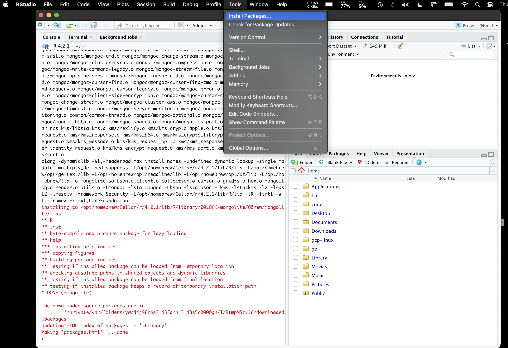

### Open a terminal and install Base R on OSX

```sh
brew install r
```

### Step 2: install [RStudio](https://www.rstudio.com/products/rstudio/download/#download)

### Step 3: install [mongolite](https://jeroen.github.io/mongolite/index.html#install-mongolite-in-r)



## cert error


## using mMongoDb in r

[How to Use R with MongoDB](https://www.mongodb.com/languages/mongodb-and-r-example)

```R
connection_string = 'mongodb+srv://<username>:<password>@<cluster-name>.mongodb.net/sample_training'
trips_collection = mongo(collection="trips", db="sample_training", url=connection_string)
```

## fixing the cert error with options

```R
trips_collection = mongo(collection="soillab", url=connection_string, options = ssl_options(weak_cert_validation = T))
```

## queries are not working

```R
> trips_collection$count('{}')
Error: not authorized on test to execute command { aggregate: "soillab", cursor: {}, pipeline: [ { $match: {} }, { $group: { _id: 1, n: { $sum: 1 } } } ], $db: "test", lsid: { id: UUID("b1e14775-e7f2-4a2e-9ee5-e58507553e73") } }
> trips_collection$info()
Error: not authorized on test to execute command { serverStatus: 1, $db: "test", lsid: { id: UUID("b1e14775-e7f2-4a2e-9ee5-e58507553e73") } }
> trips_collection$info({})
Error in trips_collection$info({ : unused argument ({
})
> trips_collection$find({limit=10})
Error: argument must be bson or json.
> trips_collection$find(limit=10)
Error: not authorized on test to execute command { find: "soillab", filter: {}, projection: { _id: 0 }, sort: {}, skip: 0, limit: 10, noCursorTimeout: false, $db: "test", lsid: { id: UUID("b1e14775-e7f2-4a2e-9ee5-e58507553e73") } }
>
```

## Studio 3T for Connecting to MongoDB

1. [3T](https://studio3t.com)


Install mongoDB:

```
npm install mongodb
```

Verify version:

```
npm list mongodb
```

Step 1: Connect to MongoDB

```
var MongoClient = require('mongodb').MongoClient;
var assert = require('assert');
```

Step 2: Retrive a list of databases

Step 3:Printing the results to your console

---

---

# Keywords

1. KCl extractable
1. labile soil
1. RMSE (Root Mean Squared Error)
   ML | Mathematical explanation of RMSE and R-squared errorhttps://www.geeksforgeeks.org › ml-mathematical-expl...
   Jun 6, 2022 — RMSE: Root Mean Square Error is the measure of how well a regression line fits the data points. RMSE can also be construed as Standard ...
1. Feature selection

---

---

1. [mongodb](https://soilspectroscopy.github.io/ossl-manual/index.html#ossl-mongodb)

# Tools and Libraries

---

---
